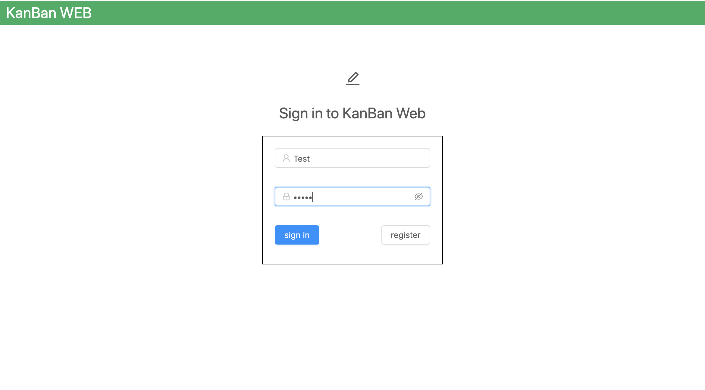
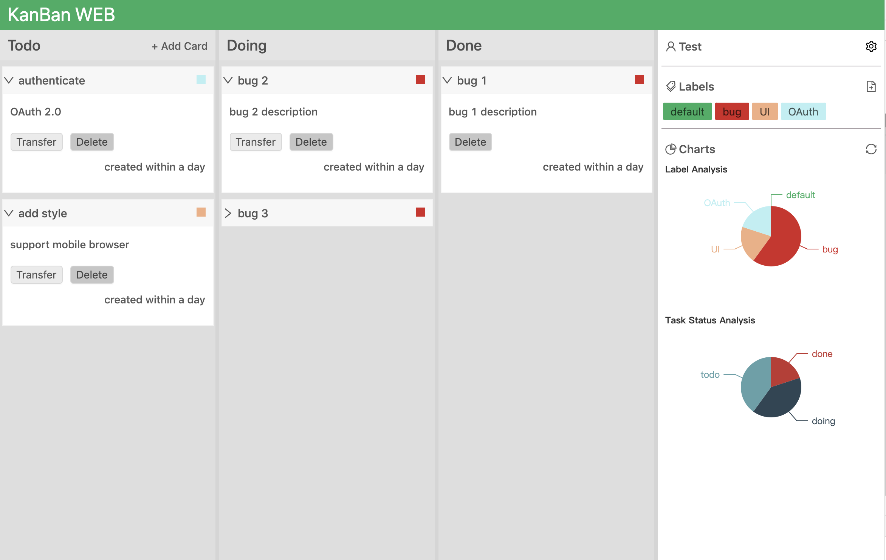

# KanBan

一个简单的个人任务管理web端应用


## Features

- 用户管理

提供用户注册和用户登陆的管理功能。注册成功后，数据库存储的用户密码是采用加盐md5（bcrypt）对明文密码加密后的结果。用户登录时，服务端解析出明文密码后调用bcrypt校验方式进行校验登录成功后会分发token，token具有2h的时效性。

- 任务管理

提供任务创建、任务删除、状态转移等功能

- 标签管理

提供标签创建、标签修改、标签删除等功能

- 图表分析

提供基于标签分析和基于任务状态分析的可视化统计图


## Preview

注册页

登陆页

应用主页


## Getting Started

Git Clone

```
git clone https://github.com/njw-bupt/kanban.git
```

启动后台

```
cd kanban

node app.js
```

启动前端

```
cd client

npm install

npm run serve
```

